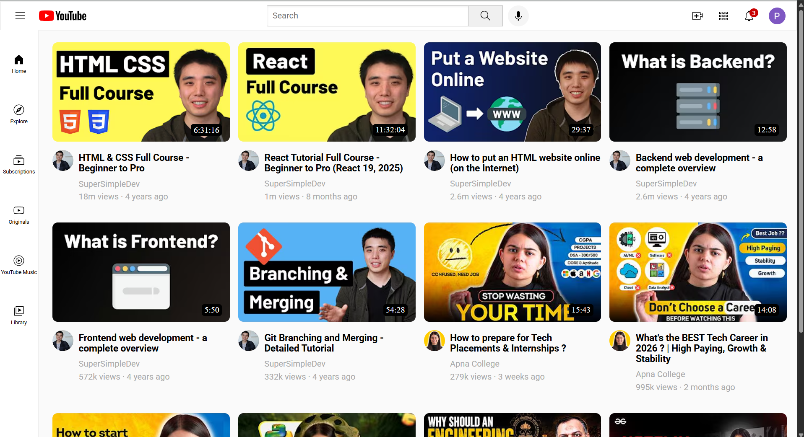

# YouTube_clone
YouTube Clone 🎬
A frontend project replicating YouTube’s layout and design, created to practice HTML and CSS after completing the SuperSimpleDev course.

🚀 Features
Structured web pages using HTML

Styled components and layouts with CSS

Responsive design for different screen sizes

Basic YouTube‑like homepage with video thumbnails

📸 Screenshots

🛠️ Technologies Used
HTML

CSS

📖 Learning Journey
This project was built as part of my learning journey in web development. It helped me understand how different elements come together to form a real‑world application.

🔮 Future Improvements
Add JavaScript for interactive features

Implement search functionality

Enhance responsiveness for mobile devices

📬 Connect
If you’d like to share feedback or collaborate, feel free to connect with me here on LinkedIn or check out my GitHub profile.
